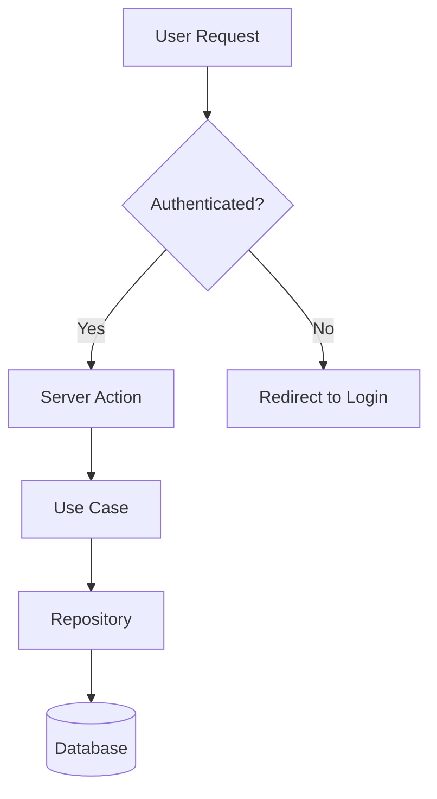

# Flow: Project Documentation

Opinion companion for **flow** (core). Documentation is a **separate Next.js app** under `docs/` in the monorepo — not a route inside the webapp.

**Hook — POST-PLAN only:** Update docs AFTER all chapters in a plan complete. Not after every chapter. The master plan template (`PLAN_TEMPLATE_MASTER.md`) triggers this.

---

**Architecture:**
- Docs app lives at `docs/` in the monorepo (separate from `webapp/`)
- Built with Next.js App Router + MDX + `@next/mdx` + `remark-gfm`
- Architecture diagrams use **React Flow + dagre** for auto-layout (prevents node overlap)
- Do NOT use elkjs (removed — group node issues in React Flow v12)
- Mermaid kept only for sequence diagrams (React Flow doesn't support lifelines)
- Design tokens shared from `packages/design-tokens/tokens.css`

Documentation is a product, not an afterthought. Diataxis structure, one concept per page, interactive diagrams, every page in exactly one category.

---

## When to Use

Apply this skill when:
- Setting up the `/docs` route in the webapp
- Creating bookmark pages during initial project scaffolding
- Adding a feature that changes user-facing behaviour (docs update in the same PR)
- Creating tutorials, how-to guides, reference pages, or explanatory content
- Reviewing documentation for structure, accuracy, or completeness
- Setting up CI pipelines for doc linting
- Making documentation AI-searchable (llms.txt, frontmatter, chunking)

Do NOT use this skill for:
- In-repo roadmaps and planning — see **roadmap**
- Code comments and JSDoc — see **coding-standards**
- API design or endpoint documentation — see **clean-architecture** for structure
- README files for individual packages (keep those minimal — link to `/docs`)

---

## Core Rules

### 1. Diataxis structure, no exceptions

Every documentation page belongs to exactly one of four categories:

| Category | Purpose | Tone | Example |
|---|---|---|---|
| **Tutorial** | Learning-oriented, guided experience | "Let me show you..." | "Build your first dashboard" |
| **How-to Guide** | Task-oriented, assumes competence | "To do X, do Y" | "How to add a custom theme" |
| **Reference** | Complete technical description | Factual, exhaustive | "Configuration options" |
| **Explanation** | Understanding, connects concepts | Discursive, contextual | "Why we use the Result pattern" |

Why: Mixing learning content with reference content serves neither audience — separating categories means each page serves its audience perfectly.

### 2. MDX is the authoring format

Markdown with JSX. Embed actual React components from the project with mocked data instead of screenshots. Screenshots rot the moment the UI changes; components update with the codebase.

```mdx
import { Button } from '@/platform/ui/Button';

## Primary Button

<Button variant="primary" size="md">Click me</Button>

The primary button uses `var(--color-primary)` and scales across three sizes.
```

Why: A live component in the docs always matches the real component — screenshots become inaccurate after the next design update.

### 3. One concept per page

Each page covers one topic completely. This serves both humans (findable, scannable) and AI retrieval (optimal chunking at 256-512 tokens per section). Use descriptive headings that contain the terms users search for.

Why: One concept per page means precise search results, better AI chunking, and focused content.

### 4. Docs are a webapp route, not a separate site

Docs live at `webapp/src/app/docs/` using Next.js App Router conventions. They deploy with the webapp — no separate framework, no separate build, no separate deployment. The same PR that changes code includes documentation changes. Vercel preview deployments include docs automatically at `/docs`.

```
webapp/src/app/docs/
  layout.tsx              # Docs shell (sidebar, search, theme toggle)
  page.mdx                # Landing page
  getting-started/
    quickstart/page.mdx
  reference/
    architecture/page.mdx
```

Why: A separate docs site (Fumadocs, Nextra, Docusaurus) adds a framework dependency, a separate build step, and deployment friction. Docs inside the webapp share the design system, deploy together, and stay in sync by default.

### 5. Auto-sync is assisted, not autonomous

Tools like DeepDocs or Mintlify Autopilot watch for code changes and propose documentation updates. A human reviews and merges. Fully autonomous doc generation produces generic, low-quality content.

Why: Fully autonomous generation is technically accurate but pedagogically useless — human review adds the judgment and context that makes docs useful.

### 6. Minimum viable documentation

In priority order, every project needs:

1. **Getting Started / Quick Start** — from zero to running in under 5 minutes
2. **How-to Guides** for the top 5-10 tasks users perform
3. **API / Config Reference** — auto-generated where possible, hand-written for nuance
4. **Architecture Overview** — one page with interactive diagrams showing how the pieces connect
5. **Troubleshooting / FAQ** — top 10 questions from real users or anticipated pain points
6. **Changelog** — what changed, when, and why it matters

During initial setup, create **bookmark pages** for each of these — a placeholder with metadata and a summary of what will go here. Bookmarks signal intent and structure before content is written.

Why: Trying to document everything leads to documenting nothing — this priority order covers the critical path from onboarding to change tracking.

### 7. Consistent structure with metadata exports

Every MDX page exports a `metadata` object (Next.js App Router convention) and a `docMeta` object for docs-specific fields:

```tsx
export const metadata = {
  title: 'How to Add a Custom Theme',
  description: 'Step-by-step guide to creating and registering a new theme with semantic colour tokens.',
};

export const docMeta = {
  category: 'guide',        // tutorial | guide | reference | explanation
  status: 'published',      // bookmark | draft | published
  tags: ['theming', 'design-system', 'css-variables'],
  lastUpdated: '2026-03-26',
  prerequisites: ['Getting Started'],
  related: ['/docs/reference/architecture'],
};
```

**Status values:**
- `bookmark` — planned placeholder. Has title and summary but content is not yet written. Shown in nav with a visual indicator.
- `draft` — content exists but is incomplete or under review. Visible in nav but marked as draft.
- `published` — complete, reviewed, ready for consumption.

Why: Without machine-readable metadata, a docs route cannot generate navigation, filter by category, or provide meaningful search results. The `metadata` export aligns with Next.js conventions; `docMeta` adds docs-specific fields.

### 8. Interactive over static

Embed live components with mocked data instead of screenshots. Use Mermaid for diagrams (version-controlled, diffable). Use Motion for entrance animations and GSAP for diagram walkthroughs. The documentation should feel like a product, not a wiki.

Interactive patterns for docs:
- **Mermaid diagrams** that rerender on theme change (light/night)
- **Animated section entrances** — fade-in + translate on scroll (Motion, staggered 30-50ms)
- **Diagram walkthroughs** — GSAP timeline that highlights nodes sequentially to show data flow
- **Expandable sections** — for long reference content (Motion, height + fade)
- **Code blocks** with copy button and "Copied!" toast

All animations must serve communication (hierarchy, state change, spatial orientation) and respect `prefers-reduced-motion`.

Why: Live components are always current, Mermaid diagrams are diffable in PRs, and purposeful animation aids comprehension of complex architectures.

### 9. Vale linter in CI

Enforce terminology, voice, and style consistency with Vale. Create a custom style package for the organisation. Block PR merges on violations.

Vale catches:
- Inconsistent terminology ("user" vs "customer" vs "client")
- Passive voice in how-to guides (should be imperative)
- Jargon without definition in tutorials
- Overly long sentences (>30 words)
- Weasel words ("simply", "just", "easily")

Why: Automated linting enforces consistency without requiring every author to memorise a style guide — the linter is the executable style guide.

### 10. AI-searchable knowledge base

Serve `llms.txt` via a route handler at `/docs/llms.txt` (dynamically generated from page metadata). Structure pages so each H2 section is a self-contained chunk (256-512 tokens). The documentation serves both humans browsing and AI agents surfacing relevant content.

```text
# llms.txt
> Sales Enablement Hub Documentation
> Internal documentation for the Sales Enablement Hub platform.

## Docs
- [Getting Started](/docs/getting-started/quickstart): Quick start guide
- [Architecture](/docs/reference/architecture): System architecture with interactive diagrams
- [Environment Variables](/docs/reference/environment-variables): All env vars with types and defaults
```

Why: Well-structured `llms.txt` and self-contained H2 sections let AI retrieve the right chunk without pulling irrelevant context.

### 11. Three-column layout for reference docs

Navigation (left), content (centre), code examples (right). The Stripe pattern. Users read the explanation while seeing the corresponding code without scrolling.

Why: Reference docs are used, not read — developers need signature, parameters, and code example visible simultaneously without scrolling.

### 12. Diagrams as code

Mermaid for sequence diagrams, flowcharts, ER diagrams, and architecture diagrams. Version-controlled, diffable, renders in-browser via a client component. Theme-aware (light/night).



Why: Mermaid diagrams are text that lives in MDX, renders automatically, and shows up as diffs in code review — image diagrams cannot be diffed.

### 13. Bookmark pattern for initial setup

During project scaffolding, create placeholder `.mdx` pages for planned documentation:

- Each bookmark has full metadata (`title`, `description`, `category`, `status: bookmark`)
- The page body contains a short summary of what will go here and any known constraints
- Bookmarks are visible in the docs nav with a visual indicator (dimmed styling, "Planned" badge)
- Bookmarks get filled in post-implementation, following the normal post-delivery hook
- Bookmark pages can include diagrams and structure even before prose is written — this is useful for architecture docs where the visual aids review

This gives the team a visible map of planned documentation from day one.

Why: An empty directory structure is invisible. Bookmark pages make the documentation plan tangible and reviewable before any features are built.

---

## Documentation Directory Structure

App Router conventions — every page is `page.mdx` inside a named directory:

```
webapp/src/app/docs/
  layout.tsx                              # Docs shell (sidebar, theme toggle, search)
  page.mdx                               # Landing page — lists sections, links to categories
  getting-started/
    quickstart/page.mdx                   # Tutorial: zero to running in 5 minutes
    installation/page.mdx                 # Tutorial: detailed environment setup
  guides/
    [task-name]/page.mdx                  # How-to: one guide per task
  reference/
    architecture/page.mdx                 # Reference: system architecture with diagrams
    api/
      [endpoint-group]/page.mdx           # Reference: one page per API group
    configuration/page.mdx                # Reference: all config options, table format
    environment-variables/page.mdx        # Reference: all env vars with types and defaults
  concepts/
    [concept-name]/page.mdx              # Explanation: one concept per page
  troubleshooting/
    common-errors/page.mdx                # Guide: error message → solution mapping
    faq/page.mdx                          # Guide: top questions, promote to guides when mature
  changelog/page.mdx                      # Chronological record of changes
  llms-txt/route.ts                       # API route — dynamically generates llms.txt
  _components/                            # Docs-specific components (not routes)
    DocsSidebar.tsx                        # Client: responsive sidebar with nav
    ThemeToggle.tsx                        # Client: light/night toggle
    MermaidDiagram.tsx                     # Client: Mermaid rendering, theme-aware
    CodeBlock.tsx                          # Client: syntax highlight + copy button
    AnimatedSection.tsx                    # Client: Motion scroll-triggered fade-in
    DiagramWalkthrough.tsx                 # Client: GSAP timeline for diagram walkthroughs
    ExpandableSection.tsx                  # Client: Motion expand/collapse
    MDXComponents.tsx                      # Maps MDX elements to styled components
```

---

## Technology Stack

| Concern | Choice | Notes |
|---|---|---|
| **Framework** | Next.js App Router + `@next/mdx` | Docs are a route group in the webapp. No separate framework. |
| **MDX processing** | `@next/mdx` with `page.mdx` files | MDX files are the route pages directly. `mdx-components.tsx` at project root maps elements to custom components. |
| **Authoring** | MDX | Live component embedding from `@/platform/` and `@/features/`. |
| **Linting** | Vale | Filter: `webapp/src/app/docs/**/*.mdx`. Same style packages (Stripe/Google/Microsoft). |
| **Diagrams** | Mermaid (via `MermaidDiagram` client component) | Renders in-browser. Theme-aware. Rerenders on theme change. |
| **Animation** | Motion (primary), GSAP (diagram walkthroughs) | Per creative-toolkit and interaction-motion skills. |
| **Search** | Custom (metadata index + client search) | Start simple. Algolia later if needed. |
| **Deployment** | Vercel (with the webapp) | No separate deployment. Preview deployments include `/docs`. |
| **AI Index** | `llms.txt` via route handler | Dynamically generated from page metadata exports. |

---

## CI Pipeline

Docs build with the webapp — no separate pipeline:

```
PR opened/updated
    │
    ├── 1. Vale Lint (docs MDX files only)
    │   └── Filter: webapp/src/app/docs/**/*.mdx
    │       └── FAIL → block merge, show violations in PR comments
    │
    ├── 2. Next.js Build (includes docs)
    │   └── Docs build as part of the webapp — no separate step
    │       └── FAIL → broken imports, invalid MDX syntax
    │
    ├── 3. Vercel Preview (includes docs)
    │   └── Docs visible at preview-url/docs
    │
    └── 4. Sync Check (optional, advisory)
        └── Flags code changes without corresponding doc changes
            └── WARN → advisory comment, not blocking
```

**Pipeline principle:** Lint and build are blocking. Deploy preview is informational. Sync check is advisory. Content quality remains a human review responsibility.

---

## Banned Patterns

### Docs as a separate site or separate build
Documentation that requires its own framework (Fumadocs, Nextra, Docusaurus), its own build pipeline, or its own deployment creates friction and drift. Docs are a route in the webapp — they share the design system, deploy together, and stay in sync by default.

### Screenshots instead of live components
Screenshots rot the moment the UI changes. Embed actual React components from the project with mocked data. The component in the docs always matches the component in the app.

### Documentation in an external wiki
Confluence, Notion, Google Docs — all invisible to the development workflow and the AI agent. Documentation must live in the repo, update in the same PR as the code it describes.

### Auto-generated docs without human review
AI-generated documentation is technically accurate but pedagogically useless without human review. It describes what code does, not why it matters or when to use it. Always review and edit generated content before merging.

### Pages that belong to multiple Diataxis categories
A page is a tutorial OR a how-to guide OR a reference OR an explanation. Never two. If a page is trying to be both a tutorial and a reference, split it into two pages. Mixed-category pages serve no audience well.

### No metadata exports
Pages without metadata are undiscoverable by search, invisible to AI retrieval, and cannot be automatically categorised or filtered. Every page needs at minimum: title, description, category, tags, status, lastUpdated.

### Reference docs as prose instead of tables
Reference documentation must be complete and scannable. Configuration options, API parameters, environment variables — these are tables, not paragraphs.

### Docs not part of the PR process
Code changes without corresponding documentation changes create drift. The PR template should include a documentation checklist. CI should flag (advisory, not blocking) when code in documented areas changes without doc updates.

### No CI linting
Without automated linting, terminology drifts, voice shifts, and style degrades. Vale in CI is the executable style guide that scales with the team.

### Giant single-page docs instead of one-concept-per-page
A single page covering "Authentication, Authorization, Sessions, Roles, and Permissions" is five pages pretending to be one. Split it. One concept per page means precise search, better AI chunking, and focused content.

### FAQ as a dumping ground
An FAQ that grows to 50 items is a failure of documentation structure. When a question appears frequently, promote it to a proper how-to guide. The FAQ should contain at most 10-15 items.

### Animation without purpose
Every animation must communicate something (hierarchy, state change, spatial orientation, feedback). Decorative motion is noise. See **interaction-motion** for principles.

---

## Quality Gate

Before considering documentation work complete, verify:

- [ ] Every page has complete metadata exports (title, description, category, tags, status, lastUpdated)
- [ ] Every page belongs to exactly one Diataxis category
- [ ] Each page covers one concept completely — not two concepts partially
- [ ] Code examples use live components with mocked data, not screenshots
- [ ] Diagrams use Mermaid (theme-aware, diffable), not image files
- [ ] Diagrams have walkthrough mode for complex architectures (GSAP timeline)
- [ ] Vale linting passes with zero violations
- [ ] The webapp builds successfully (which includes docs)
- [ ] Navigation is generated from the directory structure and metadata
- [ ] `llms.txt` route handler returns up-to-date index of all published pages
- [ ] H2 sections are self-contained chunks (256-512 tokens) for AI retrieval
- [ ] Reference pages use tables, not prose, for structured data
- [ ] Bookmark pages have `status: bookmark` and a summary of planned content
- [ ] All animations serve a communicative purpose and respect `prefers-reduced-motion`
- [ ] The PR includes both code changes and corresponding doc changes
- [ ] Docs render correctly at all breakpoints (mobile 375px, tablet 768px, desktop 1024px+)
- [ ] Light and Night themes work correctly (including Mermaid diagrams)
