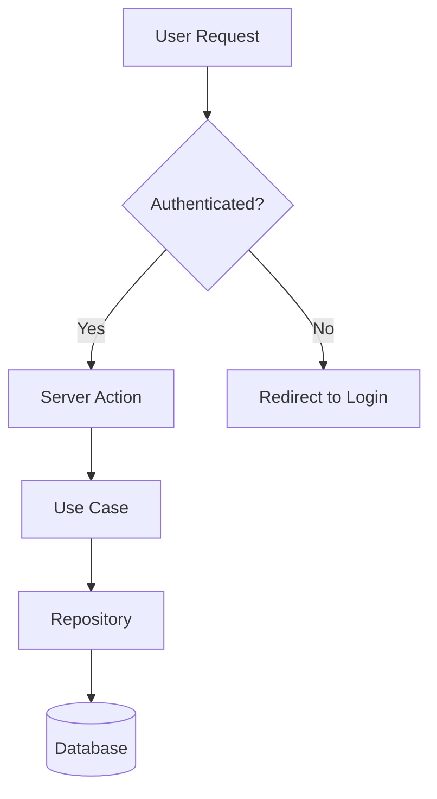

# Project Documentation

Documentation is a product, not an afterthought. It lives in the repo, deploys through CI, embeds live components instead of screenshots, and is structured so both humans and AI agents can find what they need. Every page belongs to exactly one Diataxis category. Every code change that affects user-facing behaviour includes a documentation change in the same PR.

---

## When to Use

Apply this skill when:
- Setting up documentation for a new project
- Adding a feature that changes user-facing behaviour (docs update in the same PR)
- Creating tutorials, how-to guides, reference pages, or explanatory content
- Reviewing documentation for structure, accuracy, or completeness
- Setting up CI pipelines for doc linting, building, and deployment
- Making documentation AI-searchable (llms.txt, frontmatter, chunking)
- Choosing documentation tooling (framework, linter, diagram tool)

Do NOT use this skill for:
- In-repo roadmaps and planning — see **roadmap**
- Code comments and JSDoc — see **coding-standards**
- API design or endpoint documentation — see **clean-architecture** for structure
- README files for individual packages (keep those minimal — link to the docs site)

---

## Core Rules

### 1. Diataxis structure, no exceptions

Every documentation page belongs to exactly one of four categories:

| Category | Purpose | Tone | Example |
|---|---|---|---|
| **Tutorial** | Learning-oriented, guided experience | "Let me show you..." | "Build your first dashboard" |
| **How-to Guide** | Task-oriented, assumes competence | "To do X, do Y" | "How to add a custom theme" |
| **Reference** | Complete technical description | Factual, exhaustive | "Configuration options" |
| **Explanation** | Understanding, connects concepts | Discursive, contextual | "Why we use the Result pattern" |

Why: Mixing learning content with reference content serves neither audience — separating categories means each page serves its audience perfectly.

### 2. MDX is the authoring format

Markdown with JSX. Embed actual React components from the project with mocked data instead of screenshots. Screenshots rot the moment the UI changes; components update with the codebase.

```mdx
---
title: Button Component
category: reference
---

import { Button } from '@/platform/components/Button';

## Primary Button

<Button variant="primary" size="md">Click me</Button>

The primary button uses `var(--color-primary)` and scales across three sizes.
```

Why: A live component in the docs always matches the real component — screenshots become inaccurate after the next design update.

### 3. One concept per page

Each page covers one topic completely. This serves both humans (findable, scannable) and AI retrieval (optimal chunking at 256-512 tokens per section). Use descriptive headings that contain the terms users search for.

Why: One concept per page means precise search results, better AI chunking, and focused content.

### 4. Docs live in the repo, deploy via CI

The `docs/` directory lives in the project repository. The same PR that changes code includes documentation changes. CI builds the docs site and deploys a preview on every PR. Merging to main deploys to the production URL.

Why: Docs in the repo mean same PR, same review, same deployment — the friction of updating drops to near zero.

### 5. Auto-sync is assisted, not autonomous

Tools like DeepDocs or Mintlify Autopilot watch for code changes and propose documentation updates. A human reviews and merges. Fully autonomous doc generation produces generic, low-quality content.

Why: Fully autonomous generation is technically accurate but pedagogically useless — human review adds the judgment and context that makes docs useful.

### 6. Minimum viable documentation

In priority order, every project needs:

1. **Getting Started / Quick Start** — from zero to running in under 5 minutes
2. **How-to Guides** for the top 5-10 tasks users perform
3. **API / Config Reference** — auto-generated where possible, hand-written for nuance
4. **Architecture Overview** — one page with a diagram showing how the pieces connect
5. **Troubleshooting / FAQ** — top 10 questions from real users or anticipated pain points
6. **Changelog** — what changed, when, and why it matters

Why: Trying to document everything leads to documenting nothing — this priority order covers the critical path from onboarding to change tracking.

### 7. Consistent structure with frontmatter

Every page has frontmatter: `title`, `description`, `category` (tutorial/guide/reference/explanation), `tags`, `last_updated`. This enables search, filtering, navigation generation, and AI retrieval.

```yaml
---
title: "How to Add a Custom Theme"
description: "Step-by-step guide to creating and registering a new theme with semantic colour tokens."
category: guide
tags: [theming, design-system, css-variables]
last_updated: 2026-03-19
---
```

Why: Without machine-readable frontmatter, a docs site cannot generate navigation, filter by category, or provide meaningful search results.

### 8. Interactive over static

Embed live components with mocked data instead of screenshots. Use Mermaid for diagrams (version-controlled, diffable). Use animated examples for complex interactions. The documentation should feel like a product.

```mdx
import { SkillCard } from '@/features/skill-library/widgets/SkillCardWidget';

<SkillCard
  skill={{ title: 'Example Skill', slug: 'example', description: '...' }}
  size="md"
/>
```

Why: Live components are always current and Mermaid diagrams are diffable in PRs — static screenshots rot with every UI change.

### 9. Vale linter in CI

Enforce terminology, voice, and style consistency with Vale. Create a custom style package for the organisation. Block PR merges on violations. This is how Stripe, DataDog, and Elastic maintain documentation quality at scale.

Vale catches:
- Inconsistent terminology ("user" vs "customer" vs "client")
- Passive voice in how-to guides (should be imperative)
- Jargon without definition in tutorials
- Overly long sentences (>30 words)
- Weasel words ("simply", "just", "easily")

Why: Automated linting enforces consistency without requiring every author to memorise a style guide — the linter is the executable style guide.

### 10. AI-searchable knowledge base

Generate `llms.txt` at the documentation root. Structure pages so each H2 section is a self-contained chunk (256-512 tokens). Add comprehensive frontmatter for metadata-based retrieval. The documentation serves both humans browsing and AI agents surfacing relevant content.

```text
# llms.txt
> AI Centre Documentation
> Project documentation for the AI Centre platform.

## Docs
- [Getting Started](https://docs.example.com/getting-started/quickstart): Quick start guide
- [Adding Themes](https://docs.example.com/guides/custom-theme): How to create custom themes
- [API Reference](https://docs.example.com/reference/api): Complete API documentation
```

Why: Well-structured `llms.txt` and self-contained H2 sections let AI retrieve the right chunk without pulling irrelevant context.

### 11. Three-column layout for reference docs

Navigation (left), content (centre), code examples (right). The Stripe pattern. Users read the explanation while seeing the corresponding code without scrolling.

Why: Reference docs are used, not read — developers need signature, parameters, and code example visible simultaneously without scrolling.

### 12. Diagrams as code

Mermaid for sequence diagrams, flowcharts, and architecture diagrams. Version-controlled, diffable, renders natively on GitHub. Use animated Mermaid for walkthrough visualisations where appropriate.



Why: Mermaid diagrams are text that lives in MDX, renders automatically, and shows up as diffs in code review — image diagrams cannot be diffed.

---

## Documentation Directory Structure

```
docs/
  getting-started/
    quickstart.mdx           # Tutorial: zero to running in 5 minutes
    installation.mdx         # Tutorial: detailed environment setup
    first-project.mdx        # Tutorial: build your first [thing]
  guides/
    [task-name].mdx           # How-to: one guide per task
    add-custom-theme.mdx
    deploy-to-production.mdx
    create-new-feature.mdx
  reference/
    api/
      [endpoint].mdx          # Reference: one page per API endpoint or module
    configuration.mdx         # Reference: all config options, table format
    architecture.mdx          # Reference: system architecture with diagram
    environment-variables.mdx # Reference: all env vars with types and defaults
  concepts/
    [concept-name].mdx        # Explanation: one concept per page
    result-pattern.mdx
    feature-slices.mdx
    theme-system.mdx
  troubleshooting/
    common-errors.mdx         # Guide: error message → solution mapping
    faq.mdx                   # Guide: top questions, promote to full guides when mature
  changelog.mdx               # Chronological record of changes
  llms.txt                    # AI-searchable index of all pages
```

---

## Frontmatter Template

Every documentation page uses this frontmatter structure:

```yaml
---
title: "Page Title — Descriptive and Searchable"
description: "One-sentence summary used in search results and AI retrieval."
category: tutorial | guide | reference | explanation
tags: [relevant, searchable, terms]
last_updated: YYYY-MM-DD
prerequisites:
  - "Link or name of prerequisite knowledge"
related:
  - "[Related Page Title](/path/to/page)"
---
```

**Category rules:**
- `tutorial` — guided, learning-oriented ("Build your first...")
- `guide` — task-oriented, assumes competence ("How to...")
- `reference` — complete, factual, table-heavy ("Configuration options")
- `explanation` — discursive, connects concepts ("Why we use...")

---

## CI Pipeline

The documentation pipeline runs on every PR and enforces quality before merge:

```
PR opened/updated
    │
    ├── 1. Vale Lint
    │   └── Check terminology, voice, style, sentence length
    │       └── FAIL → block merge, show violations in PR comments
    │
    ├── 2. MDX Build
    │   └── Build the docs site (Fumadocs/Nextra)
    │       └── FAIL → broken imports, invalid MDX syntax
    │
    ├── 3. Deploy Preview
    │   └── Deploy to preview URL (Vercel preview deployment)
    │       └── Post preview link as PR comment
    │
    └── 4. Sync Check (optional)
        └── DeepDocs / Mintlify Autopilot flags code changes
            without corresponding doc changes
            └── WARN → advisory comment, not blocking
```

**Pipeline principle:** Lint and build are blocking. Deploy preview is informational. Sync check is advisory. The pipeline catches mechanical errors (broken links, style violations, build failures) automatically; content quality remains a human review responsibility.

---

## Technology Stack

| Concern | Recommended | Alternative | Notes |
|---|---|---|---|
| **Framework** | Fumadocs | Nextra | Fumadocs is Next.js native, headless, App Router compatible. Nextra is faster to set up but more opinionated. |
| **Authoring** | MDX | Markdown | MDX enables live component embedding. Fall back to plain Markdown only if the project has no React components to embed. |
| **Linting** | Vale | textlint | Vale has better ecosystem, style packages from Stripe/Google/Microsoft. |
| **Diagrams** | Mermaid | D2, PlantUML | Mermaid renders natively on GitHub and in most MDX frameworks. |
| **Auto-sync** | DeepDocs | Mintlify Autopilot | Both watch for code changes and propose doc updates. Human review required. |
| **Search** | Fumadocs built-in | Algolia DocSearch | Built-in search is sufficient for most projects. Algolia for large public docs. |
| **Deployment** | Vercel | Netlify, GitHub Pages | Match the project's existing deployment platform. |
| **AI Index** | llms.txt | llms-full.txt | `llms.txt` for summary index, `llms-full.txt` for complete content if needed. |

---

## Banned Patterns

### Screenshots instead of live components
Screenshots rot the moment the UI changes. Embed actual React components from the project with mocked data. The component in the docs always matches the component in the app.

### Documentation in an external wiki
Confluence, Notion, Google Docs — all invisible to the development workflow and the AI agent. Documentation must live in the repo, deploy through CI, and update in the same PR as the code it describes.

### Auto-generated docs without human review
AI-generated documentation is technically accurate but pedagogically useless without human review. It describes what code does, not why it matters or when to use it. Always review and edit generated content before merging.

### Pages that belong to multiple Diataxis categories
A page is a tutorial OR a how-to guide OR a reference OR an explanation. Never two. If a page is trying to be both a tutorial and a reference, split it into two pages. Mixed-category pages serve no audience well.

### No frontmatter
Pages without frontmatter are undiscoverable by search, invisible to AI retrieval, and cannot be automatically categorised or filtered. Every page needs at minimum: title, description, category, tags, last_updated.

### Reference docs as prose instead of tables
Reference documentation must be complete and scannable. Configuration options, API parameters, environment variables — these are tables, not paragraphs. A developer looking up the default value of a config option should find it in a table cell, not buried in a sentence.

### Docs not part of the PR process
Code changes without corresponding documentation changes create drift. The PR template should include a documentation checklist. CI should flag (advisory, not blocking) when code in documented areas changes without doc updates.

### No CI linting
Without automated linting, terminology drifts ("user" becomes "customer" becomes "client"), voice shifts (imperative becomes passive), and style degrades. Vale in CI is the executable style guide that scales with the team.

### Giant single-page docs instead of one-concept-per-page
A single page covering "Authentication, Authorization, Sessions, Roles, and Permissions" is five pages pretending to be one. Split it. One concept per page means precise search, better AI chunking, and focused content.

### FAQ as a dumping ground
An FAQ that grows to 50 items is a failure of documentation structure. When a question appears frequently, promote it to a proper how-to guide. The FAQ should contain at most 10-15 items, and each one should be a candidate for promotion.

---

## Quality Gate

Before considering documentation work complete, verify:

- [ ] Every page has complete frontmatter (title, description, category, tags, last_updated)
- [ ] Every page belongs to exactly one Diataxis category
- [ ] Each page covers one concept completely — not two concepts partially
- [ ] Code examples use live components with mocked data, not screenshots
- [ ] Diagrams use Mermaid (or equivalent code-based tool), not image files
- [ ] Vale linting passes with zero violations
- [ ] The docs site builds successfully
- [ ] Navigation is auto-generated from the directory structure and frontmatter
- [ ] `llms.txt` is up to date with all published pages
- [ ] H2 sections are self-contained chunks (256-512 tokens) for AI retrieval
- [ ] Reference pages use tables, not prose, for structured data
- [ ] The PR includes both code changes and corresponding doc changes
